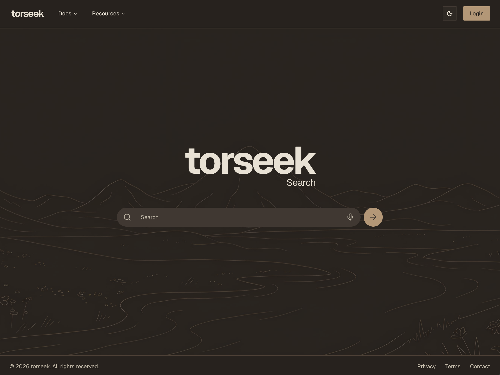

# torseek



A rewrite of [torseek](https://www.tushgaurav.com/projects/torseek), a torrent search client backed by Jackett, this time as a Node/TypeScript monorepo.

## Structure

```
torseek/
├── apps/
│   ├── api/   # Express server (@torseek/api)
│   └── web/   # Vite + React frontend (@torseek/web)
├── packages/  # shared workspace packages (empty for now)
└── package.json
```

Managed as a [Bun workspace](https://bun.sh/docs/install/workspaces).

## Getting started

Requires [Bun](https://bun.sh) 1.3+.

```bash
bun install
cp apps/api/.env.example apps/api/.env
bun run dev
```

- Web: http://localhost:5173
- API: http://localhost:8000 (health check at `/api/health`, search at `/api/search?q=...&page=1&sort=seeders_desc&cat=2000&indexers=1337x,thepiratebay`)

In development, Vite proxies `/api/*` to the Express server, so the frontend can call the API with relative URLs. In production there is no proxy: the bundle is built with `VITE_API_URL` set to the API's public origin (e.g. `https://api.torseek.org`) and calls it cross-origin, which is why the API's `CORS_ORIGIN` must be the origin the site is served from.

If `JACKETT_API_KEY` is empty, `/api/search` serves captured results from `apps/api/fixtures/` so the UI can be developed without a running Jackett instance.

## Running Jackett

Search results come from [Jackett](https://github.com/Jackett/Jackett), which proxies dozens of torrent indexers behind one API. Any Jackett instance works; for local development the repo's `docker-compose.yml` can run one behind the `jackett` profile:

```bash
docker compose --profile jackett up -d
```

1. Open http://localhost:9117. Set an admin password (top right) on first visit.
2. Click **Add indexer**, pick the indexers you want (public ones need no credentials), and save.
3. Copy the **API Key** shown at the top of the dashboard, or read it from the container:

   ```bash
   docker compose exec jackett cat /config/Jackett/ServerConfig.json
   ```

4. Put it in `apps/api/.env` as `JACKETT_API_KEY=...` and restart `bun run dev:api`.

Jackett only generates the key on first boot; there is no environment variable to preset it. The port is bound to `127.0.0.1` on purpose: the API key grants full admin access, so Jackett must never be reachable from outside the machine. The torseek API is the only client.

`GET /api/status` reports whether the API can reach Jackett and how many indexers are configured. `GET /api/indexers` lists them.

Some indexers sit behind Cloudflare and need [FlareSolverr](https://github.com/FlareSolverr/FlareSolverr). It is included as an opt-in profile:

```bash
docker compose --profile flaresolverr up -d
```

Then set **FlareSolverr API URL** to `http://flaresolverr:8191` under Jackett settings (if Jackett is the one from the `jackett` profile; otherwise use whatever address your Jackett can reach it at).

### Production

The `prod` profile runs the API and a Caddy reverse proxy. Jackett is not part of it: run Jackett however you like on the host, and tell the API where it is via `JACKETT_URL` in the root `.env`. The default, `http://host.docker.internal:9117`, reaches a Jackett listening on the host's port 9117 from inside the container.

```bash
docker compose --profile prod up -d
```

One catch with the default: `host.docker.internal` resolves to the Docker bridge gateway (`172.17.0.1`), so Jackett must listen on an interface reachable from there. A Jackett bound only to `127.0.0.1:9117` is not; bind it to `0.0.0.0:9117` (with the AWS security group leaving 9117 closed, it stays unreachable from the internet) or to `172.17.0.1:9117` specifically. If Jackett runs as a container with a published port, `-p 9117:9117` already binds `0.0.0.0` and works as-is.

Reach the Jackett admin UI over an SSH tunnel (`ssh -L 9117:127.0.0.1:9117 host`) rather than exposing it. The API container listens on `127.0.0.1:8000`; the public entry point is the `caddy` service, which terminates TLS for `API_DOMAIN` (e.g. `api.torseek.org`) with an automatically issued Let's Encrypt certificate and proxies to the API over the compose network. Its config lives in `deploy/Caddyfile`.

To point a domain at the host:

1. Allocate an Elastic IP and associate it with the instance, so the address survives stop/start.
2. Add a DNS `A` record for `api.torseek.org` (or your domain) to that IP.
3. Open inbound TCP 80 and 443 (and UDP 443 for HTTP/3, optional) in the instance's security group. Port 80 is required for the ACME challenge even though traffic is redirected to HTTPS.
4. Set `API_DOMAIN=api.torseek.org` and `CORS_ORIGIN=https://torseek.org` (the origin the frontend is served from) in the root `.env` on the VM.

`curl https://api.torseek.org/api/health` should return 200 within a few seconds of Caddy starting.

### Deploying the API from CI

`.github/workflows/deploy-api.yml` runs on every push to `main` that touches the API. It builds `apps/api/Dockerfile` on the runner, pushes it to GHCR as `ghcr.io/<owner>/<repo>/api:<sha>`, then ssh-es into the VM, copies `docker-compose.yml` and `deploy/Caddyfile`, writes `API_IMAGE=<that tag>` into the VM's `.env`, and runs `docker compose --profile prod pull && up -d --no-build api caddy` followed by a Caddy config reload. The run fails if the API container does not report healthy within about two minutes. Trigger it by hand from the Actions tab (`workflow_dispatch`) for a redeploy without a code change.

One-time VM setup:

1. Install Docker (with the compose plugin) and add the deploy user to the `docker` group.
2. Create the deploy directory (default `/opt/torseek`) with a `.env` containing at least:

   ```
   JACKETT_API_KEY=...
   JACKETT_URL=http://host.docker.internal:9117   # optional, this is the default
   API_DOMAIN=api.torseek.org
   CORS_ORIGIN=https://torseek.org
   ```

   Compose reads this file automatically; CI appends `API_IMAGE=` to it on each deploy. The API key comes from your existing Jackett's dashboard.
3. Generate a dedicated ssh key pair (`ssh-keygen -t ed25519 -f deploy_key -N ""`) and add the public half to the deploy user's `~/.ssh/authorized_keys`.

Repository secrets (Settings → Secrets and variables → Actions, or scoped to the `production` environment):

| Name                 | Value                                                        |
| -------------------- | ------------------------------------------------------------ |
| `DEPLOY_HOST`        | Public IP or hostname of the VM                              |
| `DEPLOY_USER`        | The ssh user (must be in the `docker` group)                 |
| `DEPLOY_SSH_KEY`     | Contents of the private `deploy_key`                         |
| `DEPLOY_KNOWN_HOSTS` | Optional. Output of `ssh-keyscan -H <host>`; if unset, CI trusts the host key on first connect |

Optional variable `DEPLOY_PATH` overrides the deploy directory. The image is pulled on the VM with the workflow's own `GITHUB_TOKEN`, so no registry credentials need to live on the box. If the VM is a Graviton instance, change `platforms` in the workflow to `linux/arm64`.

## Frontend

`apps/web` is a Vite + React SPA styled with Tailwind v4 and [shadcn/ui](https://ui.shadcn.com) (`bunx shadcn@latest add <component>` from `apps/web` to add more). Routing is `react-router`, theming is `next-themes` (dark by default), icons are `lucide-react`.

```
src/
├── pages/         # home, search, not-found
├── layouts/       # app shell (nav + footer + toaster)
├── components/
│   ├── ui/        # shadcn primitives
│   ├── shared/    # nav-bar, footer, mode-toggle, page
│   ├── home/      # doodle
│   └── search/    # search-bar, result card, buttons, empty state
├── content/       # site copy and menu structure
└── lib/           # api client, utils
```

### Deploying the web app from CI

`.github/workflows/deploy-web.yml` runs on every push to `main` that touches `apps/web`. It installs with Bun, runs `oxlint` and `tsc -b`, builds with Vite (the build fails if `VITE_API_URL` is unset, since the bundle would otherwise call `/api/*` on CloudFront), then authenticates to AWS with a deploy IAM user's access key stored as GitHub secrets, uploads `apps/web/dist` to an S3 bucket and invalidates the CloudFront distribution in front of it. Hashed files under `assets/` are stored with `Cache-Control: public, max-age=31536000, immutable`, `index.html` with `no-cache`, and the un-hashed files from `public/` with a five-minute TTL. New assets are uploaded before `index.html` and stale ones pruned after it, so no page ever references a chunk that is missing from the bucket. Trigger it by hand from the Actions tab (`workflow_dispatch`); a manual run from a branch other than `main` builds but does not deploy.

One-time AWS setup:

1. Create a private S3 bucket (block public access on) and a CloudFront distribution that uses it as origin through Origin Access Control. Set the default root object to `index.html` and add custom error responses that return `/index.html` with status 200 for 403 and 404, so client-side routes such as `/search` survive a hard reload. Keep the cache policy's minimum TTL at 0 so the `no-cache` on `index.html` is honoured.
2. Create an IAM user for the deploy (for example `github-deploy-web`) with no console access and attach the permissions policy below. It only needs the bucket and the distribution:

   ```json
   {
     "Version": "2012-10-17",
     "Statement": [
       {
         "Effect": "Allow",
         "Action": "s3:ListBucket",
         "Resource": "arn:aws:s3:::<BUCKET>"
       },
       {
         "Effect": "Allow",
         "Action": ["s3:PutObject", "s3:DeleteObject"],
         "Resource": "arn:aws:s3:::<BUCKET>/*"
       },
       {
         "Effect": "Allow",
         "Action": ["cloudfront:CreateInvalidation", "cloudfront:GetInvalidation"],
         "Resource": "arn:aws:cloudfront::<ACCOUNT_ID>:distribution/<DISTRIBUTION_ID>"
       }
     ]
   }
   ```

3. Create an access key for that user (IAM → Users → Security credentials → Create access key, use case "Application running outside AWS") and store the key ID and secret as the two secrets in the table below. The key is long-lived, so scope both secrets to the `production` environment rather than the repository, and restrict that environment to the `main` branch under Settings → Environments so a manual run from another branch cannot read them. To rotate, create a second key, update the secrets, then delete the old one.

Repository variables and secrets (Settings → Secrets and variables → Actions). The deploy job runs in the `production` environment, so the AWS values may be scoped to it; the `VITE_*` variables are read by the build job and must be repository-level.

| Name                         | Kind     | Value                                                                                   |
| ---------------------------- | -------- | --------------------------------------------------------------------------------------- |
| `AWS_ACCESS_KEY_ID`          | secret   | Access key ID of the deploy user above                                                  |
| `AWS_SECRET_ACCESS_KEY`      | secret   | Secret access key of the deploy user above                                              |
| `AWS_REGION`                 | variable | Region of the bucket, e.g. `eu-west-1`                                                  |
| `S3_BUCKET`                  | variable | Bucket name                                                                             |
| `CLOUDFRONT_DISTRIBUTION_ID` | variable | e.g. `E1ABCDEF2GHIJK`                                                                   |
| `VITE_API_URL`               | variable | Public origin of the API, e.g. `https://api.torseek.org`, no trailing slash             |
| `VITE_POSTHOG_PROJECT_TOKEN` | variable | Optional. PostHog project token, baked into the bundle; PostHog stays off when unset    |
| `VITE_POSTHOG_HOST`          | variable | Optional. Defaults to `https://eu.i.posthog.com`                                        |

## Scripts

Run from the repo root:

| Command             | Description                        |
| ------------------- | ---------------------------------- |
| `bun run dev`       | Start api and web together         |
| `bun run dev:api`   | Start only the Express server      |
| `bun run dev:web`   | Start only the Vite dev server     |
| `bun run build`     | Build all apps                     |
| `bun run typecheck` | Typecheck all apps                 |
| `bun run lint`      | Lint (oxlint in web)               |

Or target a single workspace: `bun run --filter @torseek/api dev`.

## Environment

See `apps/api/.env.example` and `apps/web/.env.example`. Bun loads the API's `.env` automatically; no `dotenv` needed. Vite does the same for `apps/web/.env` and inlines the `VITE_*` values into the bundle at build time, so nothing in there can be secret.
